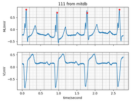

# Arrhythmia Detection using Neural Networks and Topological Data Analysis

This project aims to detect arrhythmia using a combination of neural networks and topological 
data analysis. It is based on the [Topological Data Analysis for Arrhythmia Detection through Modular Neural Networks](https://arxiv.org/abs/1906.05795) by Meryll Dindin, Yuhei Umeda, and Frédéric Chazal.

## Description
Arrhythmia refers to abnormal heart rhythms that can lead to serious health issues. This project leverages the power of neural networks and topological data analysis to detect arrhythmia patterns in electrocardiogram (ECG) signals. By extracting topological features from ECG data and training neural networks on these features, we aim to achieve accurate and efficient arrhythmia detection.

## Dependencies
The project is implemented in Python and requires the following libraries:
- scipy
- numpy
- bwr
- wfdb
- gudhi
- scikit-learn

## Data
We used open-source ECG datasets from the [PhysioNet](https://physionet.org) platform. Cardiologists independently annotated each record, whose disagreements were resolved to obtain the reference annotations for each beat in the databases.
Currently tested on:
- [MIT-BIH Arrhythmia Database [Goldberger et al., 2000; Moody and Mark, 2001]](https://www.physionet.org/content/mitdb/1.0.0/)
- [MIT-BIH Supraventricular Arrhythmia Database [Gold-berger et al., 2000; Greenwald, 1990]](https://physionet.org/content/svdb/1.0.0/)


### Reading raw data using wfdb library
```python
record = wfdb.rdrecord(test_file_path, sampfrom=2000, sampto=3000)
annotations = wfdb.rdann(test_file_path, "atr", shift_samps=True, sampfrom=2000, sampto=3000)
wfdb.plot_wfdb(record, title=test_file_name + " from " + test_database, ecg_grids='all', annotation=annotations)
```
#### data sample:

#### annotation mapping sample:

| Code       | Description                             |
|------------|-----------------------------------------|
| AFIB       | atrial fibrillation                     |
| ASYS       | asystole                                |
| B          | ventricular bigeminy                    |
| BI         | first degree heart block                |

Check out full [annotation mapping here](doc/annotation_info.md).


## Usage
1. Clone this repository:
   ```shell
   git clone https://github.com/pap1rana/arrhythmia-detection
   ```